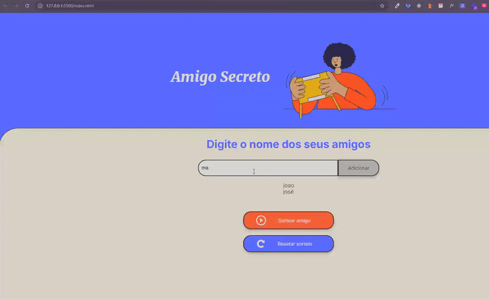
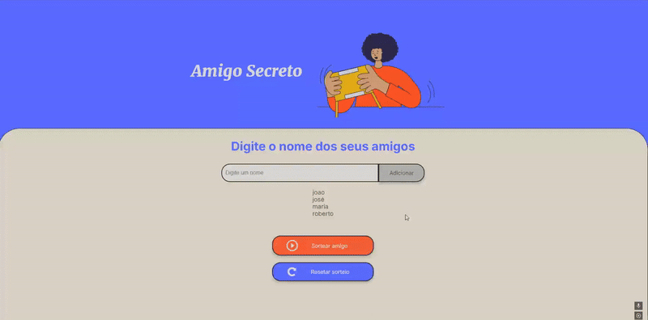
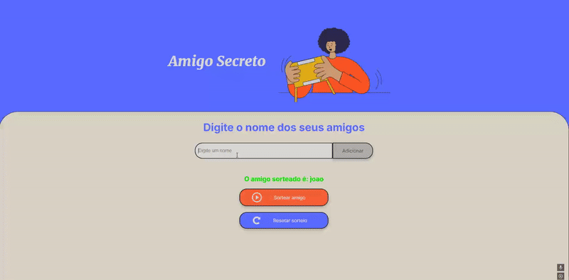

# 🎉 Challenge Amigo Secreto

Este projeto faz parte do programa ONE (Oracle Next Education) e foi desenvolvido com base no conceito de Aprendizado Baseado em Desafios. O objetivo é criar uma aplicação funcional e interativa que realiza o sorteio de amigos de maneira justa, aplicando práticas de desenvolvimento de software e estimulando o aprendizado prático por meio da resolução de problemas reais.

## 🚀 Como Funciona

1. O usuário pode adicionar um nome de amigo na caixa de texto.
2. Ao clicar no botão "Adicionar Amigo", o nome é adicionado à lista visível na tela.

   
3. Quando o usuário clicar no botão "Sortear Amigo", um amigo é sorteado aleatoriamente e o nome é exibido na tela.

   
4. Após o sorteio, o usuário não pode mais adicionar amigos até que o sorteio seja reiniciado.

5. Ao clicar em "Reiniciar Sorteio", a lista de amigos e o resultado do sorteio são apagados, permitindo que o processo seja reiniciado.
   

## ✨ Funcionalidades

- **🌟 Adicionar Amigo:** O usuário pode adicionar amigos à lista de sorteio inserindo um nome no campo de entrada.
- **🎮 Sortear Amigo:** Após adicionar amigos, o usuário pode realizar o sorteio, que escolhe aleatoriamente um amigo da lista.
- **♻️ Reiniciar Sorteio:** O usuário pode reiniciar a lista e começar o processo novamente, permitindo adicionar novos amigos.

## 🛠️ Requisitos

Este código funciona em qualquer ambiente de desenvolvimento web moderno. Basta abrir o arquivo HTML no seu navegador para utilizá-lo.

